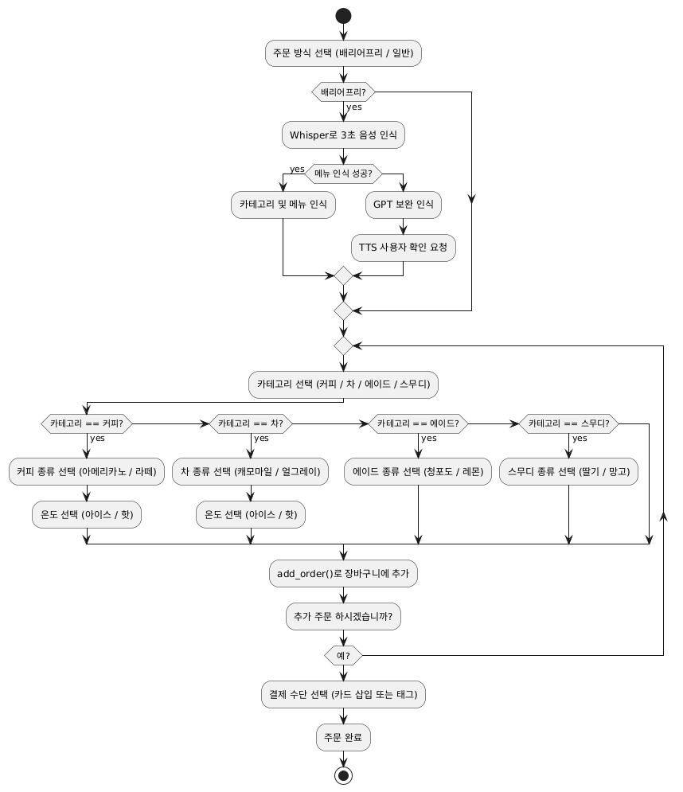

# 🎙️ Barrier-Free Kiosk

> Voice-enabled cafe kiosk that lets visually impaired and mobility-impaired users order by speaking.

<br>

## Overview

Cafe kiosks are designed around touch screens, which makes them hard to use for people with visual or mobility impairments. This project combines a Streamlit touch kiosk with speech recognition (STT) and speech synthesis (TTS) so users can place an order by voice and hear every step read back to them. Both a standard touch order flow and a barrier-free voice order flow are supported.

<br>

## Approach

- **Data**: Menu and prices load from `data/menu_price.xlsx` (4 categories, 8 drinks), shared by both order flows
- **Touch Order**: Streamlit walks through category → menu → temperature → cart → payment → order number
- **Speech-to-Text**: `sounddevice` records 5 seconds of audio, and the OpenAI Whisper API (`whisper-1`) transcribes it in Korean
- **Order Parsing**: Drink names are matched in the transcript; quantity (`N잔`) and temperature (`아이스` / `핫`) are extracted with regular expressions
- **Text-to-Speech**: `pyttsx3` reads back added items, the menu, the running total, and the final summary

<br>

## Results

| Mode | Input | Feedback |
|---|---|---|
| Standard Order | Touch buttons | On-screen cart, total, and order number |
| Barrier-Free Order | Voice commands | Spoken confirmation for each step |

- Voice commands cover adding drinks (`아이스 아메리카노 2잔`), asking for the menu (`메뉴`), asking for the total (`얼마`), and finishing the order (`종료`, `결제`, `다 했어`)
- Temperature applies only to coffee and tea; ade and smoothie orders ignore it

<p align="center">
  
</p>

<br>

## Tech Stack

| Category | Stack |
|---|---|
| Languages |  |
| Data Analysis |    |
| NLP & LLM |  |
| Web App |  |
| Speech |      |

<br>

## Project Structure

```text
barrier-free-kiosk/
├── data/
│   ├── images/            # Menu images (coffee, tea, ade, smoothie)
│   └── menu_price.xlsx    # Menu and price table
├── docs/
│   └── workflow/          # Order workflow diagrams
├── materials/             # Lecture materials (not needed to run the app)
│   ├── slides/            # Lecture slides, worksheet, and setup guide (PDF)
│   ├── videos/            # Demo videos
│   ├── syllabus/          # Course syllabus (HWP)
│   ├── code/              # Day 2–3 tutorial code, OpenAI API notebooks, examples
│   ├── environment.yml    # Conda environment used in the lectures
│   └── requirements.txt   # Extra packages for lecture code
├── src/
│   ├── config.py          # Project paths
│   ├── menu.py            # Menu loading from the price table
│   ├── order_parser.py    # Quantity / temperature / drink extraction from text
│   └── speech.py          # Recording, Whisper STT, pyttsx3 TTS
├── .env.example           # API key template
├── requirements.txt
├── README.md
├── app.py                 # Streamlit kiosk entry point
└── voice_order.py         # Voice order entry point
```

<br>

## Getting Started

Requires Python 3.11, a microphone, and an OpenAI API key.

```bash
pip install -r requirements.txt
cp .env.example .env       # Then set OPENAI_API_KEY in .env
```

Run the kiosk (the **배리어프리 주문** button launches `voice_order.py`):

```bash
streamlit run app.py
```

Run the voice order flow on its own:

```bash
python voice_order.py
```

`.env` is listed in `.gitignore` and is never committed.

### Lecture Materials

Lecture code needs a few extra packages, plus `ffmpeg` for the audio-splitting cell in `02_tts_and_stt.ipynb`. `ffmpeg` is a system program, so it is not in any `requirements.txt`.

```bash
pip install -r materials/requirements.txt
brew install ffmpeg        # macOS; on Windows, install from ffmpeg.org and add it to PATH
```

All lecture code reads `OPENAI_API_KEY` from the same root `.env`. Run each script from its own folder so relative paths (images, menu, audio samples) resolve.

| Material | Command |
|---|---|
| Day 2 ChatGPT API | `cd materials/code/day2/stage1_chatgpt_api && python 00_basic_chat.py` |
| Day 2 Whisper | `cd materials/code/day2/stage2_whisper && python 00_whisper_example.py` |
| Day 3 Streamlit basics | `cd materials/code/day3/bonus_streamlit && streamlit run 00_text.py` |
| Day 3 Full kiosk | `cd materials/code/day3/full_kiosk && streamlit run app.py` |
| Day 3 Simple kiosk | `cd materials/code/day3/simple_kiosk && streamlit run simple_app.py` |
| OpenAI API notebooks | `jupyter notebook materials/code/openai_api` |

- Swap the file name to run the other numbered scripts in each folder
- `simple_kiosk/barrier_free_kiosk.py` is an exercise template with TODOs, so its voice mode fails until the functions are filled in
- `01_whisper_chatgpt_example.py` loops until `Ctrl+C` and calls the API on every turn
- `materials/code/examples/` uses the local Whisper model, which needs `pip install openai-whisper torch` and downloads a ~1.5 GB model on first run

<br>

## Notes

- Based on [DeepnHigh/Barrier_Free_KIOSK](https://github.com/DeepnHigh/Barrier_Free_KIOSK); restructured into `src/` modules with a single menu source and `.env`-based API key loading
- Voice orders run in the terminal, separate from the Streamlit cart, so they are not shown on screen
- Recording length is fixed at 5 seconds, so long or short utterances can lower recognition accuracy
- Drink names need an exact match in the transcript; the workflow diagram's GPT fallback recognition is not implemented yet
- Future work: streaming STT, wake-word activation, and showing voice orders in the Streamlit cart

<br>

## License

Copyright © 2026 Coders CUK. All rights reserved.

This repository is provided for viewing and portfolio evaluation purposes only.

No permission is granted to copy, modify, distribute, sublicense, publish, or commercially use any part of this project, including its source code, assets, documentation, design, or other contents, without prior written permission from the copyright holder.

If you want to use this project or any portion of it, please obtain written permission from the repository owner in advance.
